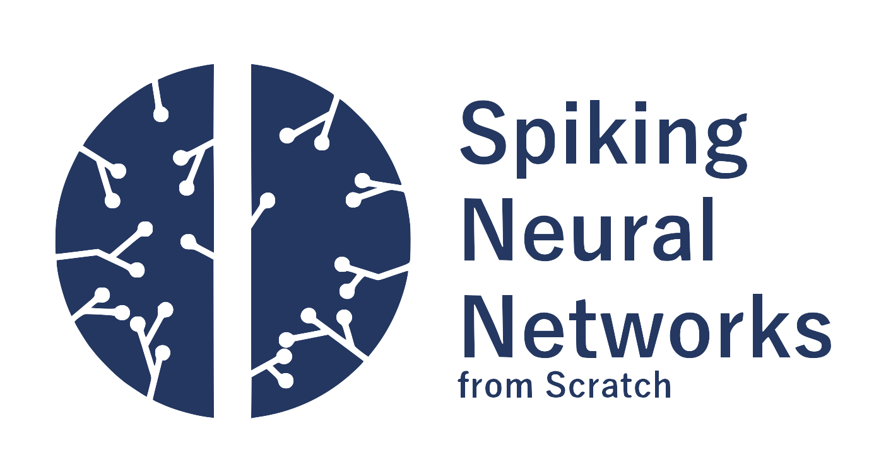

## ゼロから学ぶスパイキングニューラルネットワーク

本サンプルコードは[ゼロから学ぶスパイキングニューラルネットワーク](https://snn.hirlab.net)
で取り扱っているコードをまとめたものです．

## ファイル構成
コードは全て[codes/](codes)ディレクトリに入っています．

ファイル名は**s4-1-1_Poisson.py**のような名前になっていますが，これは
**第4章第1節に出てくる1番目の「Poisson」に関するコード**という意味です．

## Pythonと外部ライブラリ
本コードは以下の環境で実行できます．

* Python 3.6.x
* NumPy
* Matplotlib

## ライセンス
本リポジトリのソースコードは[MITライセンス](LICENSE.txt)です．
商用・非商用問わず，自由にご利用ください．

Copyright (c) 2021 [HiroshiARAKI](https://hirlab.net)